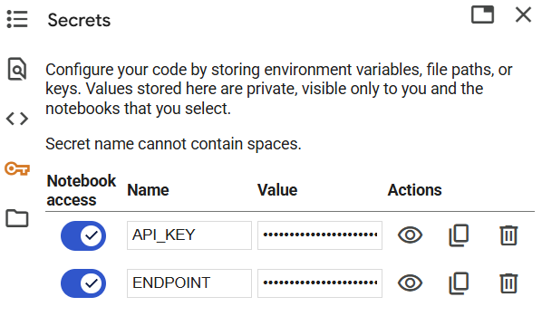
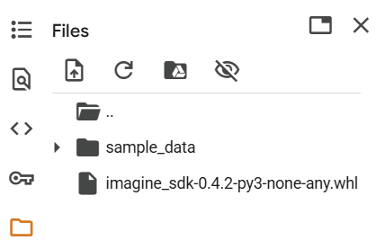

# Qualcomm AI Inference Suite 
# Makes it Easy to Get Started
### Using Google Colab
Building off of the blog post [here](https://www.qualcomm.com/developer/blog/2025/05/using-qualcomm-ai-inference-suite-is-easy) which shows how easy it is to call the Cirrascale AI Inference Cloud using the Qualcomm AI Inference Suite, we'll use Google Colab to show the same scenario. In the blog, we assume that the user has Python installed, but if you wanted to use [Google Colab](https://colab.research.google.com/) to try it out without installing anything locally, this sample is for you.

## Prepare your environment
[Google Colab](https://colab.research.google.com/) allows you to write and use Python in your browser without having to install or configure it on a physical machine. While it also allows use of GPUs free of charge, we won't be needing any for this sample as the AI inference is done at Cirrascale.  You can use Google Colab freely with any existing Google account.

### Create a New Notebook
If you haven't already, create a new notebook by choosing **File > New Notebook**.

### Add secrets to hide your endpoint choice and API key
Google Colab offers a place to store 'secrets' which can be actual secrets or arbitrary pieces of data that you want to access from code without showing them to the end user on screen. 

To create the secrets for this exercise, click on the **key** icon in the left side menu and add two name-value pairs for API_KEY and ENDPOINT.  We'll be using these later in the code to retrieve the actual values. You'll need to sign up for an account at Cirrascale and retrieve the key from [your dashboard](https://aisuite.cirrascale.com/account/api-keys) if you don't already have one.

---

---

### Upload the Qualcomm Imagine SDK wheel file
This sample requires access to the Qualcomm Imagine SDK, which is provided as a wheel file. The easiest way to do this is to first [download the file locally](https://aisuite.cirrascale.com/sdk/_downloads/3433649516f5c32f3603ae6f98c65e48/imagine_sdk-0.4.2-py3-none-any.whl) to your machine, and then upload it to Google Colab.

To provide the file to Google Colab, you choose the **folder** icon in the left side menu, and choose to upload the wheel file from your local machine.  If successful, you should see the file listed in the UI.

---

---

## Code walkthrough
Now that we have everything set up, we are ready to walk through the code running in a notebook, step by step. You can execute code a section at a time, or all at once.  To add new sections, choose the **+Code** command in the menu bar.

### Import SDK functions
First, we need to install the uploaded SDK into the running virtual environment on Google Colab.

```
!pip install imagine_sdk-0.4.2-py3-none-any.whl
```

To the left of code sections is a **play / go** button that you can click to execute the code snippet.  Do that now to ensure the Qualcomm Imagine SDK is loaded into the environment

> NOTE: If your environment times out because you weren't using it,</br> 
> you may need to re-upload the wheel file.

For our first line of code, we will import the functions we need from the SDK:

```python
from imagine import ChatMessage, ImagineClient
```

### Grab secrets for use in code
Now, we will retrieve the secrets we stored earlier and assign them to variables that we'll use later when calling the inference service.

```python
from google.colab import userdata

# store endpoint and API key
myendpoint = userdata.get('ENDPOINT')
myapikey = userdata.get('API_KEY')
```

### Create a client and choose your model
We create a client for our service using the function **ImagineClient** while supplying the endpoint and key. We also set a variable to hold the choice of model we want to call. The model can be any [LLM currently running](https://aisuite.cirrascale.com/models/overview) on the Cirrascale service.

For this sample, we'll use **Llama-3.1-8B** but the larger 70B model works just as well.


```python
# create a client
client = ImagineClient(endpoint=myendpoint, api_key=myapikey)

# choose an LLM to use
mymodel = "Llama-3.1-8B"

```

### Prepare your prompt
With any LLM, we are supplying a prompt to guide the response we want to get back, in this case to evaluate some customer feedback. The next set of code simply shows how to build a two part prompt to make it easy to try out different feedback to see if the LLM evaluates in the way we expect.

```python
# a test piece of customer feedback
feedback = "Feedback: ' We loved this hotel, we will be coming back.'"

# building the prompt
mycontent = "You are an expert at sentiment analysis. Please evaluate the following customer feedback and answer only with positive, negative, or neutral. Only answer positive, negative, or neutral in lowercase. " + feedback
```

### Build your chat message and call the server
Using the second SDK function **ChatMessage** we will prepare our message to the inference server and make the call using all of the parameters we now have ready to go.

```python
# setting up the chat message to the server
mymessage = ChatMessage(role="user", content=mycontent)

# call the server
chat_response = client.chat(
    messages=[mymessage],
    model=mymodel,
)
```

### Print out the response
Finally, we will print out the response. If everything went well, you should see the word "positive" appear after running your last step.  If you want to vary the output, simply change the input above with some negative or neutral customer feedback of any kind.

```python
# print out the response
print(chat_response.first_content)
```

### Summary
That's it! If you've made it this far, you were successful and can see how easy it is to use Google Colab to learn and modify this simple example to handle any kind of prompt against all of the installed models.

**[Star this repo](https://github.com/qualcomm/cloudai-inference-samples)** to follow updates in the future as we create more code samples.

## Requirements

To run this sample, one needs to obtain an account and API key from Cirrascale [here](https://aisuite.cirrascale.com/home).

## Installation Instructions

The sample runs in Python and uses the latest stable version of the Qualcomm Imagine SDK. You can install it by downloading the [wheel file](https://aisuite.cirrascale.com/sdk/_downloads/3433649516f5c32f3603ae6f98c65e48/imagine_sdk-0.4.2-py3-none-any.whl) into an environment with Python 3.9 or higher. After downloading the file, install it with:

```
pip install imagine_sdk-0.4.2-py3-none-any.whl
```

## Development

Code samples are provided as purely samples and are not intended for production use. If you have suggestions for how to improve or directions you'd like to see, please see how to contribute via the [CONTRIBUTING.md file](../CONTRIBUTING.md).

## Getting in Contact

* [Report an Issue on GitHub](../../../issues)
* [Open a Discussion on GitHub](../../../discussions)
* [E-mail us](mailto:raysteph@qti.qualcomm.com) for general questions

## License

cloudai-inference-samples is licensed under the [BSD-3-clause License](https://spdx.org/licenses/BSD-3-Clause.html). See [LICENSE.txt](../LICENSE.txt) for the full license text.
